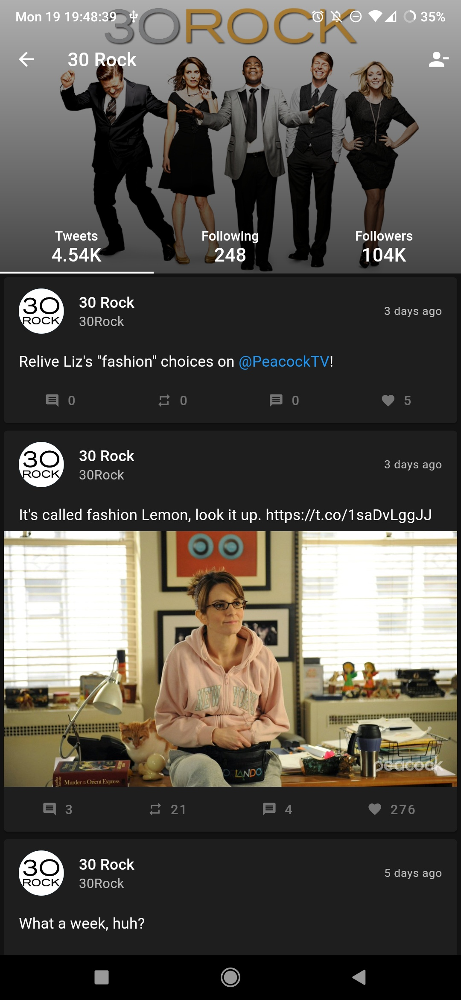
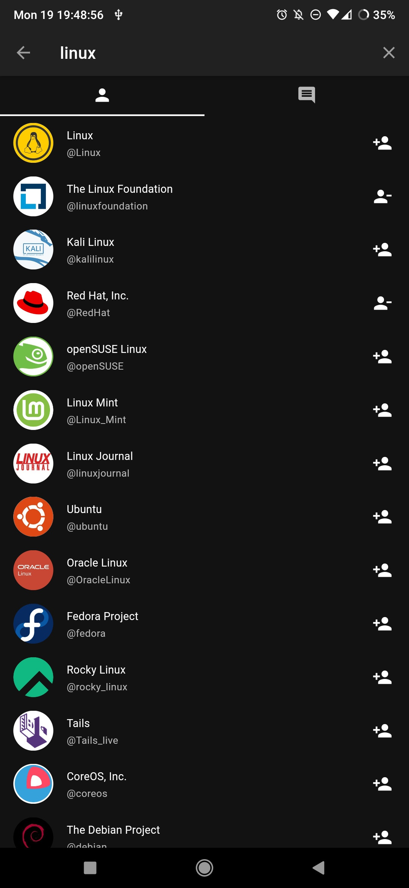

<h1 align="center"> Fritter </h1>  

  

  A free, open-source Twitter client for Android and iOS.

  

## Features

* Device-local subscriptions and groups, Newpipe-style, including a feed view
* Viewing profiles
* Viewing tweets and replies
* Viewing pictures, videos and GIFs in tweets
* Searching for tweets and users
* Viewing trending topics
* Supports opening twitter.com links directly

## Screenshots

|  |  |  |  |

## Acknowledgments

Icons made by [Freepik](https://www.freepik.com) from [www.flaticon.com](https://www.flaticon.com).
